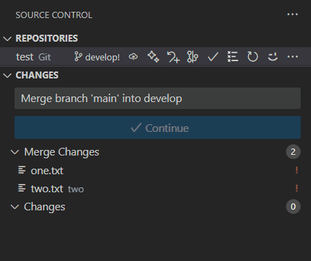

# Conflicts filelist

This extension adds a button to the Source Control Management (SCM) panel. When clicked, it automatically appends a list of files with conflicts to the commit message, if any conflicts are present. 

